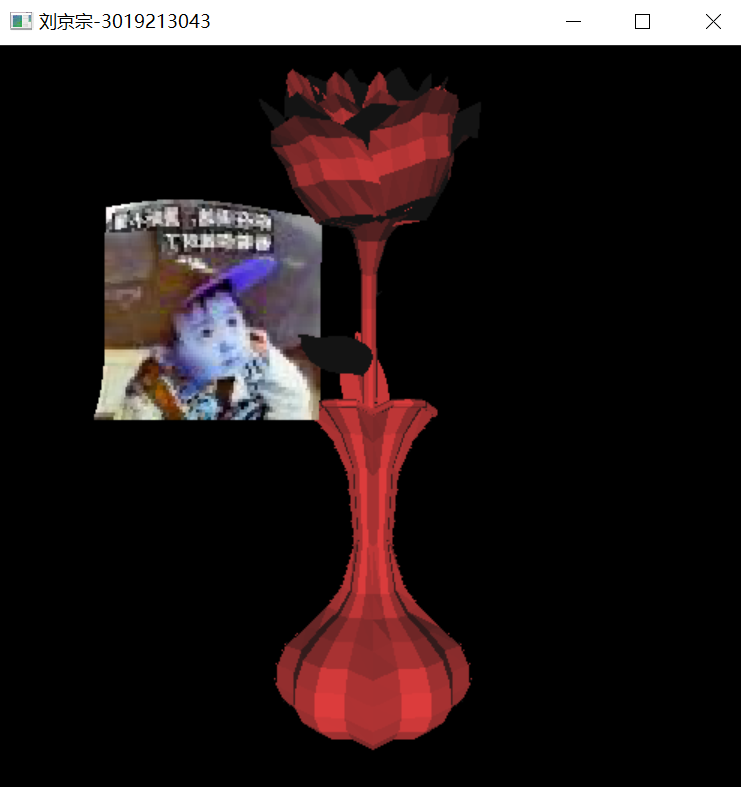

# 计算机图形技术两次平时作业

## 实验一

1) 实现obj文件的加载。

2) 对模型加键盘控制，通过键盘可以实现模型的缩放、平移和旋转 。‘w’、‘s’、‘a’、‘d’分别控制模型的上下左右移动。‘q’‘e’分别控制模型的放大、缩小。‘o’‘u’分别控制模型的顺时针和逆时针的旋转。

3) 对相机加鼠标控制，主要包含以下两个功能：

​	a. 模型本身保持固定，拖动鼠标左键实现视角（lookat matrix）的改变。按下左键，向右拖动视角变小，向左拖动视角变大。

​	b. 模型本身保持固定，拖动鼠标右键实现视点(viewpoint position)的移动。按下右键，鼠标向哪个方向移动，视点就向哪个方向移动。

## 实验二

本次作业在第一次作业的基础上，增加一个bezier曲面，并对场景添加光照和纹理效果。具体如下:

1)以bezier曲面模拟—面旗帜，曲面至少包含5*5个控制点。

2)在场景中使用phong光照模型来得到合理的光照效果。

3)对场景中的模型添加纹理贴图,图片自行选择，不同类型的模型采用不同的贴图。

## 最终效果

